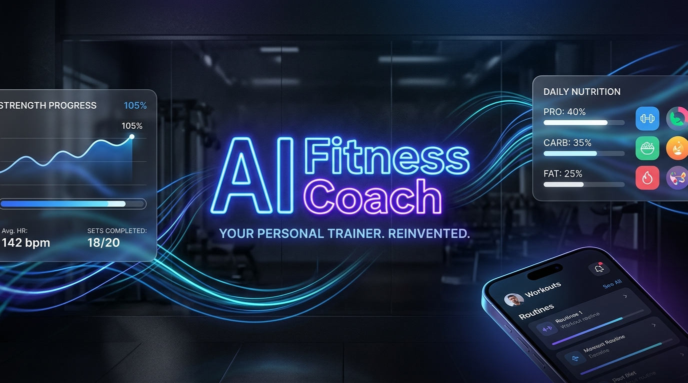
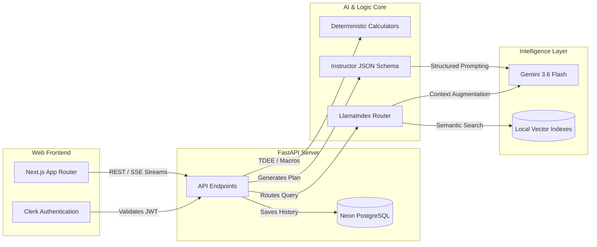

<div align="center">
  
  
  <h1>⚡ Agentic Fitness Coach</h1>
  <p><strong>A production-grade, hyper-personalized AI fitness platform built with Next.js, FastAPI, and Agentic RAG.</strong></p>
</div>

---

## 📖 Overview

Agentic Fitness Coach is not a standard prompt-wrapper. It is a **Compound AI System** that leverages mathematical determinism for safety-critical calculations (TDEE, Macros) and Agentic RAG (Retrieval-Augmented Generation) for subjective coaching. 

By combining a sleek **Next.js 16 App Router** frontend with a high-performance **FastAPI** backend, the application delivers macro-perfect daily diet plans, structured weekly training regimes, and scientifically backed conversational coaching.

---

## 🏗️ System Architecture

The application is strictly decoupled into a modern frontend and a scalable backend.



### 1. The Frontend (`/web`)
*   **Next.js 16.3 (Turbopack)**: Blazing fast server-side rendering and client routing.
*   **Aesthetics**: Built with Tailwind CSS and Framer Motion, featuring a dark-themed, glassmorphic UI.
*   **State & Auth**: Integrated seamlessly with **Clerk** for secure user authentication.

### 2. The Backend (`/agentic-fitness-app`)
*   **FastAPI Engine**: Fully asynchronous, high-performance Python backend.
*   **Neon Database**: Serverless PostgreSQL manages user profiles and persists generated diets/programs linked to `clerk_id`.
*   **Instructor**: Enforces rigorous JSON schemas on Google Gemini's outputs, guaranteeing that the frontend receives parsable arrays rather than raw markdown text.

### 3. The Agentic RAG Engine
The `/coach` endpoint utilizes **LlamaIndex** to act as a routing agent:
1.  **Query Analysis**: The LLM reads the incoming user question.
2.  **Dynamic Routing**: It selects the most appropriate local Vector Index (`Nutrition`, `Training`, or `Mentality`) based on semantic similarity.
3.  **Synthesis**: It retrieves chunks of actual sports science literature and synthesizes a scientifically accurate, highly motivational response.

### 4. Deterministic Guardrails
AI is prone to hallucinations, which is dangerous for caloric mathematics. This system **completely isolates** math from the LLM. TDEE, macronutrient splits, and volumetric adjustments are calculated using strict Python implementations of the Harris-Benedict and Mifflin-St Jeor equations. The LLM is only used to select and scale recipes to fit those mathematical constraints perfectly.

---

## 💻 Local Setup Instructions

This system is engineered to run seamlessly across Windows, Mac, and Linux. All legacy C++ compilation dependencies (like FastEmbed and PyStemmer) have been replaced with highly compatible Python-native alternatives (`sentence-transformers`).

### 1. Backend Setup (FastAPI)

Open a terminal and navigate to the project root:

```bash
# 1. Create a virtual environment
python -m venv venv

# 2. Activate it
venv\Scripts\activate       # Windows
source venv/bin/activate    # Mac/Linux

# 3. Install Python dependencies
pip install -r requirements.txt
```

Set up your `.env` file inside the `agentic-fitness-app/` directory:
```env
GEMINI_API_KEY=your_gemini_key_here
DATABASE_URL=your_neon_postgres_url_here
```

Initialize the database and start the server:
```bash
cd agentic-fitness-app
python reset_db_script.py
python -m uvicorn app.main:app --reload --port 8000
```

### 2. Frontend Setup (Next.js)

Open a **second** terminal window and navigate to the `web/` directory:

```bash
cd web
npm install
```

Set up your `.env.local` file inside the `web/` directory:
```env
NEXT_PUBLIC_CLERK_PUBLISHABLE_KEY=your_clerk_publishable_key
CLERK_SECRET_KEY=your_clerk_secret_key
```

Start the development server:
```bash
npm run dev
```

### 3. Launch
Open [http://localhost:3000](http://localhost:3000) in your browser, securely log in via Clerk, and start interacting with your new AI Coach!

---

## 🔒 Security & Privacy
The backend enforces strict data ownership. All history endpoints decode the Clerk JWT Bearer token natively in Python to extract the user's secure `clerk_id`, guaranteeing that user diet plans and training programs are entirely private and impenetrable to unauthorized access.
