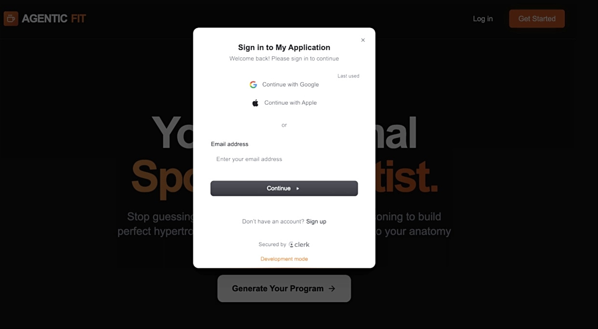
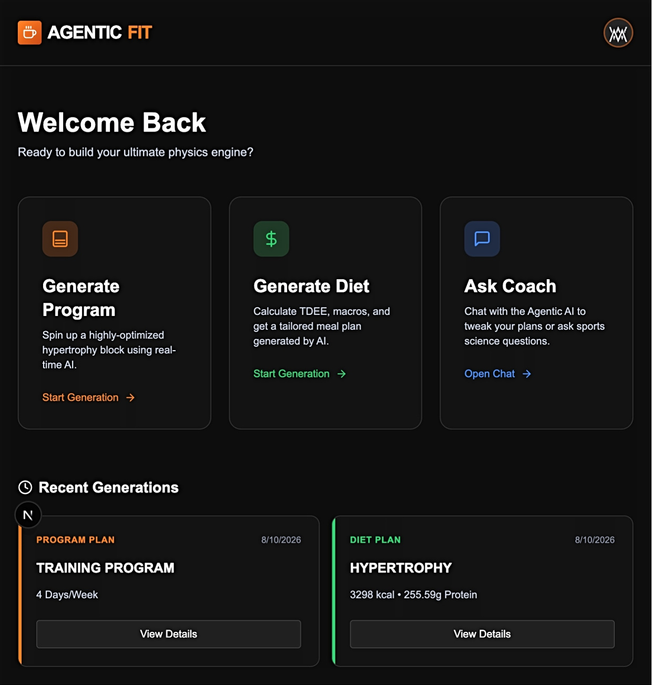
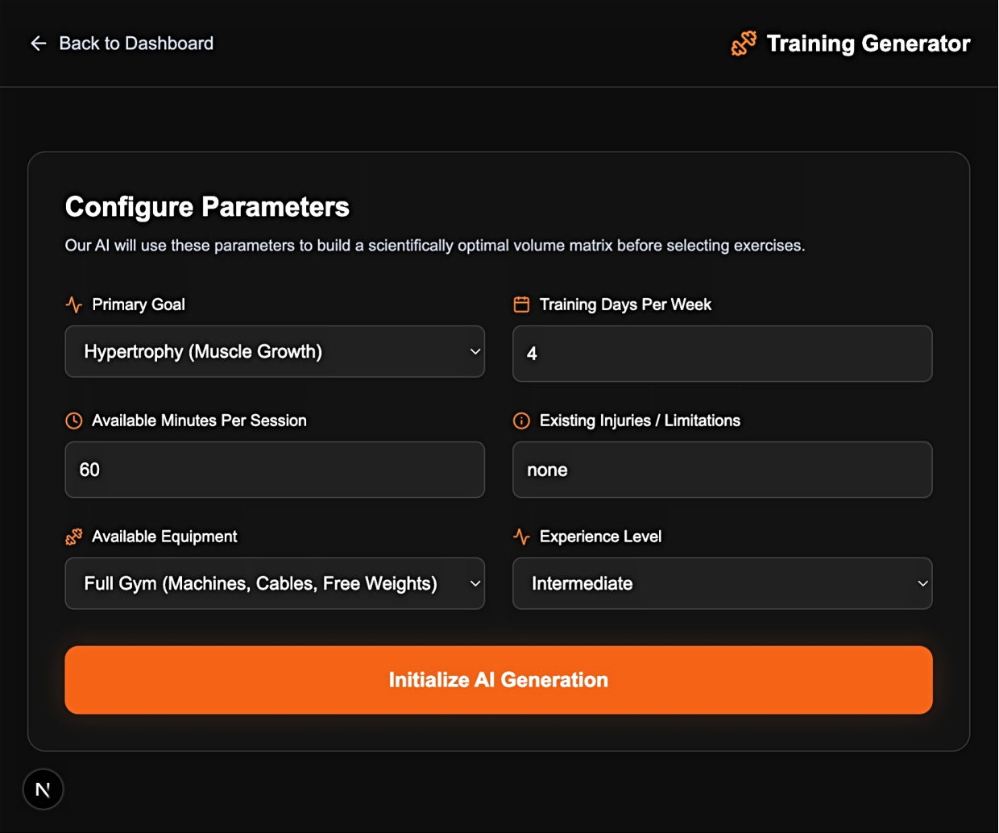
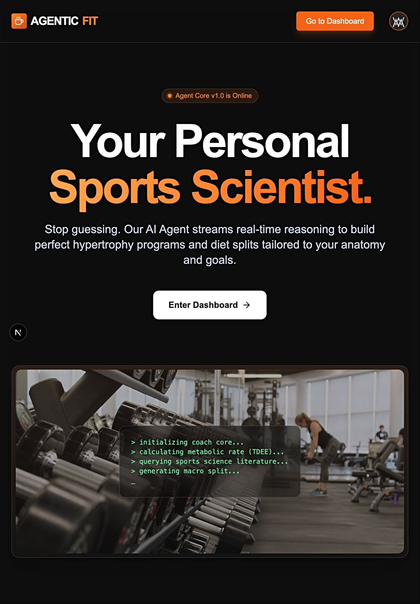
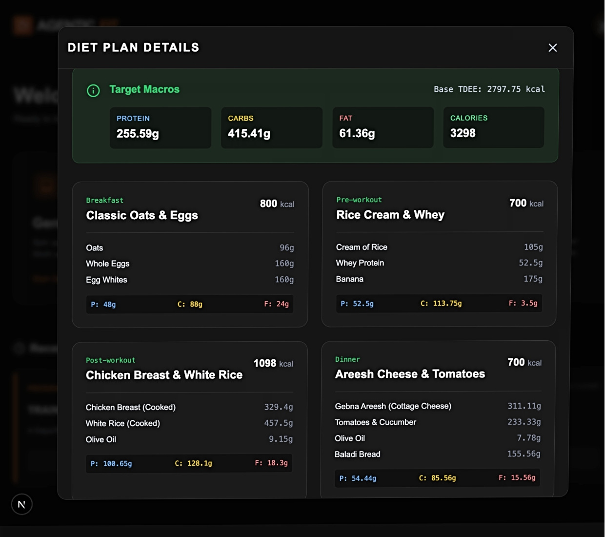
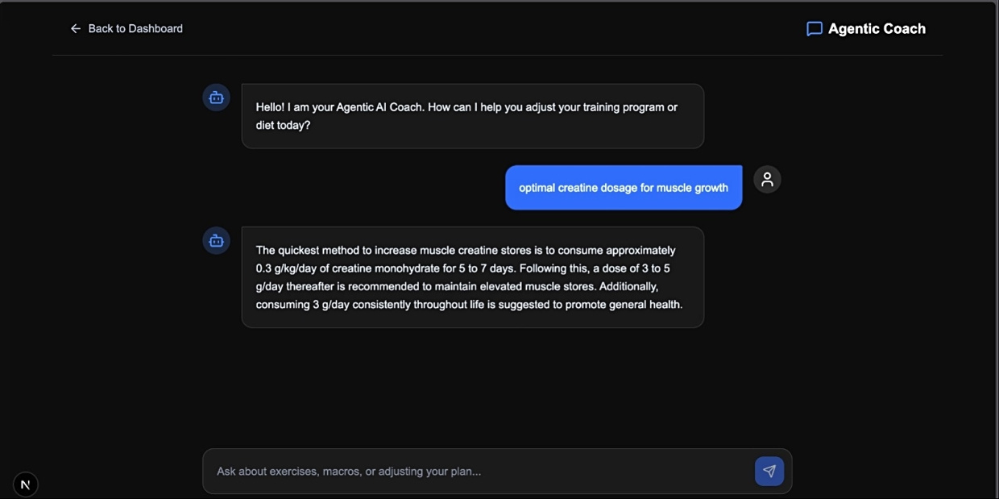
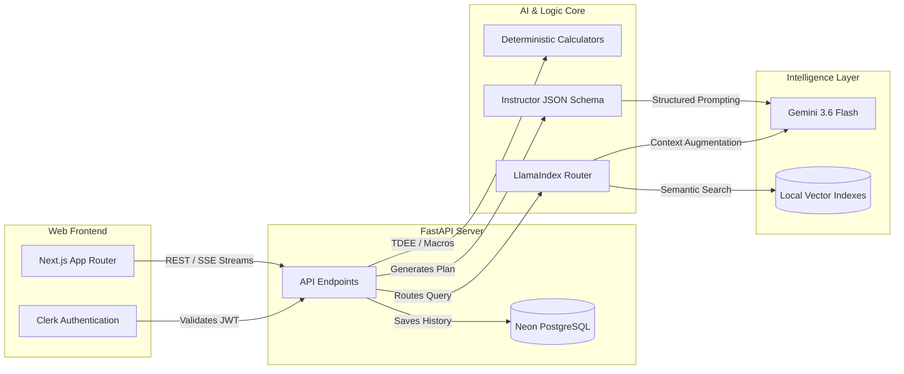

<div align="center">
  
  
  
  
  
  <br/>
  <br/>

  <h1>⚡ Agentic Fitness Coach</h1>
  <p><strong>A production-grade, hyper-personalized Compound AI System.</strong></p>
  
  <a href="#-overview">Overview</a> • 
  <a href="#-ui-showcase">UI Showcase</a> • 
  <a href="#%EF%B8%8F-system-architecture">Architecture</a> • 
  <a href="#-the-13-phase-engineering-masterplan">13-Phase Masterplan</a> • 
  <a href="#-local-setup">Setup</a>
</div>

---

## 📖 Overview

Agentic Fitness Coach is not a standard prompt-wrapper. It is a **Compound AI System** that leverages mathematical determinism for safety-critical calculations (TDEE, Macros) and Agentic RAG (Retrieval-Augmented Generation) for subjective coaching. 

By combining a sleek **Next.js 16** frontend with a high-performance **FastAPI** backend, the application delivers macro-perfect daily diet plans, structured weekly training regimes, and scientifically backed conversational coaching—all while guaranteeing **zero mathematical hallucination**.

---

## 📸 UI Showcase

<table style="width:100%; border-collapse: collapse; border: none;">
  <tr>
    <td align="center" style="width:50%; border: none; padding: 10px;">
      <h3>🔒 Secure Authentication</h3>
      
    </td>
    <td align="center" style="width:50%; border: none; padding: 10px;">
      <h3>🎛️ Command Dashboard</h3>
      
    </td>
  </tr>
  <tr>
    <td align="center" style="width:50%; border: none; padding: 10px;">
      <h3>🎚️ Generative Forms</h3>
      
    </td>
    <td align="center" style="width:50%; border: none; padding: 10px;">
      <h3>⚡ Streaming AI Reasoner</h3>
      
    </td>
  </tr>
  <tr>
    <td align="center" style="width:50%; border: none; padding: 10px;">
      <h3>🥩 Deterministic Macros</h3>
      
    </td>
    <td align="center" style="width:50%; border: none; padding: 10px;">
      <h3>💬 Agentic RAG Coach</h3>
      
    </td>
  </tr>
</table>

---

## 🏗️ System Architecture

The application is strictly decoupled into a modern frontend and a scalable backend.



---

## 🚀 The 13-Phase Engineering Masterplan

This system was engineered from the ground up over 13 distinct phases. Click to expand the architecture deep-dive:

<details>
<summary><b>🧠 The Intelligence Layer (Phases 1-6)</b></summary>

1. **Data Ingestion & Chunking**: Parsed advanced sports science PDFs into manageable text nodes using hybrid chunking strategies.
2. **Local Embeddings**: Converted text into dense mathematical vectors using the open-source `BAAI/bge-small-en-v1.5` model for private, fast processing.
3. **Vector Persistence**: Saved embeddings to a local JSON database for instant, zero-cold-start booting.
4. **Hybrid Search Integration**: Combined semantic vector search with BM25 exact-keyword search to accurately retrieve specific supplements and general hypertrophy concepts simultaneously.
5. **Cross-Encoder Reranking**: Implemented a neural cross-encoder (`ms-marco-MiniLM-L-2-v2`) to re-score and filter the top 3 most relevant paragraphs, drastically reducing noise.
6. **Agentic Routing**: Integrated LlamaIndex `RouterQueryEngine` allowing the LLM to dynamically route queries to specific databases (Nutrition, Training, or Mentality) rather than searching blindly.
</details>

<details>
<summary><b>⚙️ The Logic & Backend Layer (Phases 7-9)</b></summary>

7. **Deterministic Guardrails**: Replaced LLM math with strict Python calculators. TDEE, macronutrient distributions, and volumetric meal sizing are hard-coded to ensure biologically optimal numbers.
8. **Structured Generation**: Utilized the `Instructor` library to force Gemini to output perfect, strictly-typed Pydantic JSON schemas instead of raw markdown text.
9. **API Development**: Wrapped the entire intelligence engine in a high-performance, asynchronous FastAPI server.
</details>

<details>
<summary><b>💻 The Application Layer (Phases 10-11)</b></summary>

10. **Frontend Engineering**: Built a premium, glassmorphic Next.js 16 UI leveraging Server-Sent Events (SSE) to stream the AI's "thinking" to the user in real-time.
11. **Security & Persistence**: Integrated Clerk for JWT authentication and a Neon Serverless PostgreSQL database to securely persist generated diets and programs by user ID.
</details>

<details>
<summary><b>🛡️ The Production Layer (Phases 12-13)</b></summary>

12. **RAG Evaluation (LLM-as-a-Judge)**: Built an automated testing suite where a zero-temperature LLM mathematically scores the RAG pipeline on *Faithfulness* and *Answer Relevance*.
13. **CI/CD Pipelines**: Configured GitHub Actions to automatically run the LLM Evaluation Suite on every pull request. If the AI hallucinates, the build fails.
</details>

---

## 💻 Local Setup

This system is engineered to run seamlessly across Windows, Mac, and Linux.

### 1. Backend Setup (FastAPI)

```bash
# 1. Create and activate a virtual environment
python -m venv venv
venv\Scripts\activate       # Windows
# source venv/bin/activate  # Mac/Linux

# 2. Install Python dependencies
pip install -r requirements.txt
```

Set up your `.env` file inside the `agentic-fitness-app/` directory:
```env
GEMINI_API_KEY=your_gemini_key_here
DATABASE_URL=your_neon_postgres_url_here
```

Initialize the database and start the server:
```bash
cd agentic-fitness-app
python reset_db_script.py
python -m uvicorn app.main:app --reload --port 8000
```

### 2. Frontend Setup (Next.js)

Open a **second** terminal window:

```bash
cd web
npm install
```

Set up your `.env.local` file inside the `web/` directory:
```env
NEXT_PUBLIC_CLERK_PUBLISHABLE_KEY=your_clerk_publishable_key
CLERK_SECRET_KEY=your_clerk_secret_key
```

Start the development server:
```bash
npm run dev
```

### 3. Launch
Open [http://localhost:3000](http://localhost:3000) in your browser, securely log in via Clerk, and start interacting with your new AI Coach!

---

<div align="center">
  <p>Built with 💻 and ☕</p>
</div>
